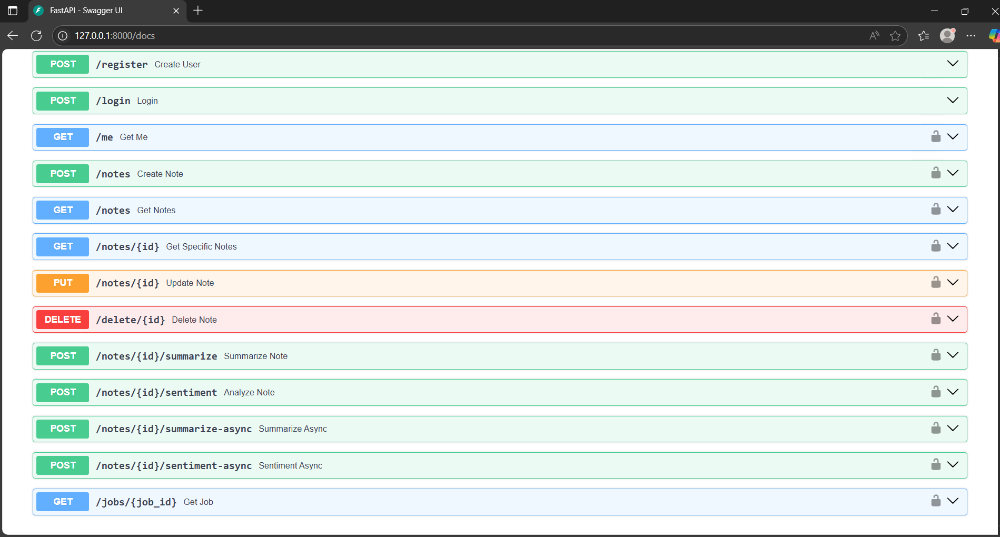

# AI Notes API – Smart Summaries & Sentiment

An authenticated notes API with **text summarization** and **sentiment analysis** powered by Hugging Face, plus **background job processing** for long-running ML. Built with **FastAPI + SQLAlchemy + Pydantic v2 + Postgres**.

<p align="center">
  
</p>

## ✨ Features

- **JWT auth** (register/login, `/me`)
- **Notes CRUD** with ownership enforcement
- **Summarization** (`sshleifer/distilbart-cnn-12-6`) – sync & async
- **Sentiment analysis** (`distilbert-base-uncased-finetuned-sst-2-english`) – sync & async
- **Background jobs** with status tracking (`PENDING → RUNNING → SUCCEEDED/FAILED`)
- **Caching**: skip recompute if note unchanged since last analysis
- **Typed schemas** (Pydantic v2), clean separation of models/schemas/utils

## 🧱 Tech Stack

- FastAPI, SQLAlchemy, Pydantic v2
- PostgreSQL
- Hugging Face `transformers` pipelines
- Uvicorn

## 🚀 Quickstart (local)

> Prereqs: Python 3.11, Postgres running locally

```bash
git clone <https://github.com/fahimakhalifa/ai-notes-api.git>
cd ai-notes-api
python -m venv venv
# Windows:
venv\Scripts\activate
# macOS/Linux:
# source venv/bin/activate

pip install -r requirements.txt

# Copy env and fill with your DB creds
copy .env.example .env   # Windows
# cp .env.example .env   # macOS/Linux

# Create database in Postgres matching .env (DATABASE_NAME)
# Then run the server:
uvicorn app.main:app --reload
